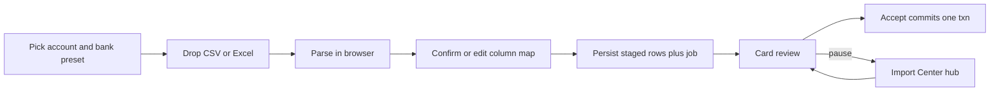

# CSV / Excel Import Center

## What exists today

[`src/routes/imports.tsx`](src/routes/imports.tsx) is a **non-functional mock**: New import / Sync / review buttons do nothing; progress is a fake `setInterval`; [`getImportSources` / `getImportJobs` / `getImportReviewItems`](src/data/repository.ts) return empty arrays.

Postgres already has hub tables (`import_sources`, `import_jobs`, `import_review_items`) in [`supabase/migrations/20260811150200_planning_workshop.sql`](supabase/migrations/20260811150200_planning_workshop.sql), but **not** PRD `import_profiles`, staging rows, or merchant rules. Ledger writes go through [`fn_record_transaction`](supabase/migrations/20260811150100_core_money.sql), which hardcodes `source = 'manual'` and never sets `external_ref` (the existing unique dedupe column).

Gmail/PDF are **out of this pass** (your choice). Transfers are **not auto-detected**; rows import as income/expense. User can edit later.

## Settled product decisions

- **Formats:** CSV and Excel (`.xlsx` / `.xls`) parsed **in the browser**. Raw file is not uploaded.
- **Banks:** First-class presets for **HDFC savings, HDFC credit card, DBS**. Other Indian banks use the generic mapper; a successful map is saved and reused.
- **Hub + wizard:** Keep Connected sources, Parsing activity, and Needs your eye. Add a real import wizard. Review is **Tinder-style cards**, and a job can be **paused and resumed** (commit part of the file, come back later).
- **Categorisation:** Light merchant heuristics + review. Accepting a correction writes a simple merchant → category rule for next time. Default slice = the account’s `is_default` label (PRD “Unassigned”).
- **Transfers:** not offered in this pass.

Record these in [`docs/DECISIONS.md`](docs/DECISIONS.md).

## Target flow

1. **New import** opens a wizard: target account (required) → optional bank preset → file.
2. Parser skips bank header junk, detects delimiter, maps columns (date, narration, debit, credit, amount, balance). Auto-apply preset if headers match; otherwise show mapping UI.
3. On confirm, create/reuse an `import_sources` row (CSV + account + profile name), an `import_jobs` row, and **staging rows** (parsed data only — not the file).
4. Hub shows the job as in progress (`rows_done` / `rows_total`). **Needs your eye** is the remaining queue (and low-confidence heuristic hits).
5. Card review: one staged row at a time — date, merchant, amount, suggested category/type. Actions: **Accept** (write ledger), **Edit then accept**, **Skip**, **Hold**. Keyboard on desktop; swipe on touch.
6. Re-importing the same mapped file: hashes match → those rows land as skipped duplicates, job still records counts. Two same-day same-amount lines in one file both survive (hash includes occurrence index inside the file).

**Connected sources:** each saved CSV profile (account + bank format) is a source. **Sync now** means “import another file with this mapping.” Gmail/PDF appear as disabled coming-soon tiles, not live sync targets.

## Schema and RPC (new migration)

Create via `supabase migration new` (do not hand-name files).

- **`import_profiles`:** `user_id`, `account_id`, `source_id` (nullable), `bank_preset` (e.g. `hdfc_savings` | `hdfc_cc` | `dbs` | `custom`), `mapping` jsonb (column indexes, date format, debit/credit vs signed amount, header row, skip rows), unique per user+account+preset.
- **`import_job_rows` (staging):** `job_id`, parsed fields (occurred_at, merchant, descriptor, amount_paise, type income|expense, raw_line jsonb), `import_hash`, `status` (`pending` | `imported` | `skipped_duplicate` | `skipped` | `held`), `suggested_category_id`, `transaction_id` after accept. Unique `(job_id, import_hash)`.
- **`import_rules`:** `user_id`, `match` (normalized merchant contains), `category_id`, maybe `account_id` null = global. Written on edit-accept.
- Extend **`fn_record_transaction`** with `p_source` (default `'manual'`), `p_external_ref`, `p_confidence` so CSV rows are idempotent and distinguishable from manual entry. Unique `ux_txn_external` already exists on `(user_id, external_ref)`.
- Optional **`fn_commit_import_row`**: security-definer: verify row belongs to `auth.uid()`, skip if hash already on a live txn, call record, mark row imported, bump job counters. Keeps swipe-accept atomic.
- Wire [`src/data/live.ts`](src/data/live.ts) + repository (replace empty stubs) + [`src/integrations/supabase/types.ts`](src/integrations/supabase/types.ts).

**Hash:** `sha256(account_id | date | signed_amount | normalized_narration | n)` where `n` is the 0-based index among rows that share the same date+amount+narration **in this file**. Same file twice → same `n` → skip. Two genuine identical charges in one statement → `n=0` and `n=1`.

**Privacy:** persist parsed rows for resume; never store the original file.

## Client parse and presets

New module e.g. [`src/lib/import/`](src/lib/import/):

- CSV via a small parser (Papa Parse or equivalent); Excel via SheetJS (`xlsx`) in the browser only.
- Bank presets as data files (header aliases, skip-until-header, DD/MM/YYYY vs ISO, separate withdrawal/deposit columns vs one amount column). Start with well-known **HDFC NetBanking / HDFC CC / DBS** layouts; refine if you later drop anonymized samples.
- Heuristics: keyword lists (SWIGGY → Dining, UPI/NEFT narration as merchant extract, salary credits → Salary). Confidence drives whether the card is “easy accept” vs “needs your eye.” No transfer pairing.
- Mapping UI: preview first ~8 rows, required fields date + amount direction + description.

## UI

Rebuild [`src/routes/imports.tsx`](src/routes/imports.tsx) against live data; empty states when no sources/jobs.

- Wizard: dialog or `/imports/new` then return to hub (prefer a **full-width panel/route** so mapping tables are usable at 375px with stacked steps).
- Review: `/imports/$jobId` or a dedicated panel — card stack, remaining count, “Done for now” back to hub. Held rows stay in Needs your eye.
- Remove the fake progress timer; `rows_done` is resolved row count from the DB.
- Source overflow: Rename, Pause (stop prompting), Disconnect (soft-delete source/profile). No Gmail OAuth.

Match existing AppShell / Panel / primary buttons; loading, empty, and error states; dark/light; no dead controls.

## Tests and docs

- Unit tests for hash occurrence-index, HDFC/DBS fixture rows → mapped fields, duplicate file no-ops.
- Manual / Playwright: map → stage → accept one → leave → resume → remaining queue; second import of same fixture changes nothing.
- Update DECISIONS; do not rewrite PRD history — note live model (category on `transactions`, default slice, staged rows) where it diverges.

## Out of scope

Gmail OAuth, PDF/password statements, transfer matching, bulk “accept all remaining,” uploading files to Storage, rewriting the PRD double-entry story.
